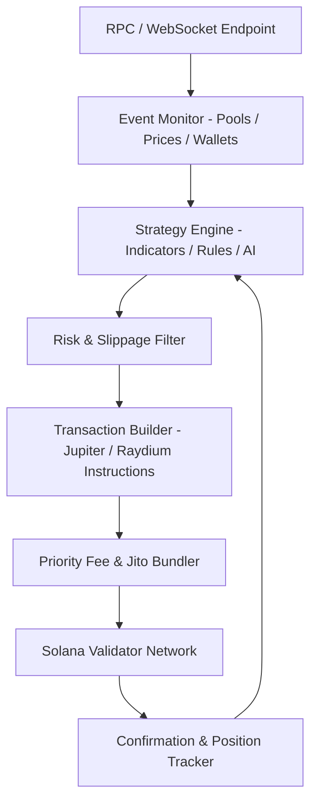

# Solana Trading Bot v2026 

## Deploy Solana Trading Bot for automated swaps on Jupiter, Raydium, and other DEXs with low-latency RPC integration, real-time monitoring, and strategy execution. High-throughput non-custodial automation layer for Solana blockchain.

### Introduction

A Solana Trading Bot functions as a specialized execution environment for automated trading directly on the Solana blockchain. It interacts with decentralized exchanges (DEXs) like Jupiter Aggregator, Raydium, Orca, and Pump.fun through RPC nodes and program interfaces to monitor on-chain events, evaluate opportunities, and submit optimized transactions. Built around Solana’s high-throughput architecture, these systems emphasize sub-second execution in a permissionless environment.

In 2026’s fast-moving Solana ecosystem, such automation layers help traders capture volatility in meme coins, manage liquidity positions, or implement systematic strategies without constant manual oversight.

### Inside the System: Core Mechanism

The bot operates as a reactive transaction engine. It subscribes to blockchain events (new pools, price updates, wallet activity) via WebSocket-enabled RPC endpoints, processes data through strategy logic, constructs and signs transactions using libraries like @solana/web3.js, and submits them with priority fees for reliable inclusion.

Key layers include:
- **Data Ingestion**: Real-time streams from RPC, Geyser plugins, or aggregator APIs (e.g., Jupiter v6).
- **Decision Engine**: Rule-based, indicator-driven, or AI-augmented logic for entry/exit conditions.
- **Execution Module**: Transaction building, bundling (via Jito), and submission with slippage and compute unit management.
- **Feedback Loop**: Confirmation monitoring and position tracking.

This architecture supports custom source builds in TypeScript or Rust for tailored performance.

### Target Audience and Operational Use Cases

Developers, experienced DeFi traders, and quantitative operators form the core user base. Practical applications include:
- Sniping new token launches on Pump.fun or Raydium with rapid buy logic.
- Arbitrage across DEX liquidity pools.
- Automated DCA or grid trading for major pairs like SOL/USDC.
- Copy trading high-performing wallets via on-chain monitoring.
- MEV-aware execution or liquidity provision automation.

The system targets users comfortable with wallets, RPC configuration, and basic scripting rather than retail beginners.

### Technical Architecture and Workflow

Solana Trading Bot leverages Solana’s parallel processing and fast finality:
1. **RPC Connection Layer**: Dedicated or premium nodes for low-latency data and transaction forwarding.
2. **Event Monitoring**: Subscriptions to program logs, account changes, or aggregator endpoints.
3. **Strategy Processing**: Analysis of on-chain metrics, indicators (e.g., via Birdeye or custom oracles), and risk parameters.
4. **Transaction Construction & Routing**: Build swap instructions, optimize via Jupiter, add priority fees, and bundle if needed.
5. **Post-Execution Telemetry**: Confirmation checks, PNL calculation, and adaptive adjustments.

**Operational Logic**

This loop enables responsive, on-chain automation with built-in safety mechanisms.

### Key Features and Performance Considerations

- **Aggregator Integration**: Seamless routing through Jupiter for best prices and minimal slippage.
- **Low-Latency Execution**: Optimized for Solana’s ~400ms block times with dynamic priority fees.
- **Strategy Flexibility**: Sniping, arbitrage, DCA, grid, copy-trading, and custom logic.
- **Security Model**: Non-custodial — users control private keys and sign transactions locally.
- **Monitoring**: Real-time dashboards for positions, fees, and performance metrics.

**Optimization Note**: Performance depends on RPC quality, network congestion, and fee strategy. Premium endpoints and Jito integration significantly improve success rates during high activity.

### Where It Fits in the Market: Positioning

Solana-native bots excel in speed and cost compared to multi-chain or CEX-focused solutions. They offer deeper on-chain integration than centralized platforms while providing more automation than manual DEX trading.

| Aspect              | Solana Trading Bot     | CEX Bots (e.g. Binance) | Open-Source Custom | Manual DEX Trading |
|---------------------|------------------------|-------------------------|--------------------|--------------------|
| Execution Speed     | Very High (on-chain)  | High (off-chain)       | Highest (tuned)    | Low                |
| Risk Management     | Custom filters & stops| Built-in               | Fully programmable | Manual             |
| Ease of Use         | Intermediate-Advanced | Beginner-friendly      | Developer-focused  | High expertise     |
| Setup Time          | 30-90 minutes         | Minutes                | Hours/Days         | Ongoing            |
| Automation Depth    | On-chain specific     | Strategy templates     | Unlimited          | None               |
| API / Extensibility | RPC + Program calls   | REST/WebSocket         | Full control       | N/A                |
| Best Use Case       | DEX sniping & arb     | Futures/Spot automation| Advanced quant     | Active monitoring  |

### Risk Surface and Limitations

- **Smart Contract & Protocol Risk**: Interactions with DEX programs carry potential vulnerabilities.
- **Network Congestion**: High activity can increase fees and failure rates despite prioritization.
- **MEV and Front-Running**: Competitive environment where faster bots may outpace yours.
- **Wallet & Key Security**: Compromised keys lead to total loss; use hardware wallets and minimal permissions.
- **Capital & Strategy Risk**: No guarantees — poor parameters or market shifts can result in losses.

Always audit code, use test transactions, and start with small positions.

### Deployment Notes

1. Set up a Solana wallet and fund it with SOL for fees and trading capital.
2. Configure a reliable RPC endpoint (dedicated preferred) and install dependencies (@solana/web3.js, Jupiter SDK, etc.).
3. Implement or configure strategy parameters, slippage tolerance, and risk limits.
4. Test extensively on devnet or with small real amounts.
5. Deploy via script or container; monitor logs and implement alerts for anomalies.

Validate RPC latency, wallet security, and transaction simulation before scaling.

### Conclusion

Solana Trading Bot represents a powerful non-custodial execution layer tailored to the blockchain’s speed and ecosystem. Through tight integration with DEX aggregators, real-time on-chain data, and flexible strategy engines, it empowers operators to implement sophisticated automation. Success depends on technical proficiency, robust infrastructure, disciplined risk management, and ongoing adaptation to network conditions.

### FAQ

**Is a Solana Trading Bot safe for use?**  
Non-custodial bots keep funds in your control, but risks from code bugs, RPC issues, and phishing remain. Use audited open-source projects, hardware wallets, and test thoroughly.

**Does it support API integration for custom strategies?**  
Yes — most implementations leverage Jupiter API, Raydium programs, and Solana RPC/WebSocket for full customization in TypeScript, Rust, or Python.

**Is it suitable for beginners?**  
Basic setups like DCA via Jupiter tools can be approachable, but advanced sniping or arbitrage requires programming knowledge and market understanding. Start with guided templates.

**How does it compare to manual trading?**  
Automation provides 24/7 speed and emotion-free execution with lower fees than CEXs, but demands proper configuration and monitoring to avoid technical failures.

**What are the primary risks?**  
Key concerns include transaction failures during congestion, smart contract exploits, MEV competition, and strategy underperformance. Conservative sizing, priority fees, and regular reviews help mitigate them.
